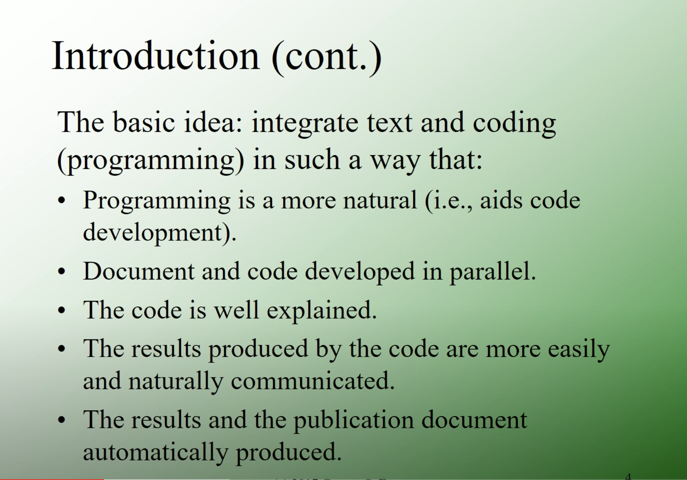

## Introduction

We've been using R Notebooks this summer mainly as an interface for working through exercises on various topics. This seems to work fine, but it's not really the main intent of an R Notebook. The development of R Notebooks supports the idea of "Literate Programming". Below is a screenshot from Emory professor George Easton's youtube presentation on R Notebooks, describing Literate Programming: 





The real purpose for R Notebooks is to generate polished documents the integrate code, code outputs, and formatted text. In the context of academia, these outputs could be:

* Scientific manuscripts
* Student-created assignments
* Laboratory manuals
* Slides / presentations
* Documents for scientific communication / community engagement

Let's looks at some of the main components of R Notebooks, after which we'll create one from scratch.


## YAML

The very top section of this document contains the "YAML" section (YAML = YAML Ain't Markup Language). 

Let's look at some of the basic parts of the YAML header [here](https://zsmith27.github.io/rmarkdown_crash-course/lesson-4-yaml-headers.html).


## R Markdown

R Markdown is basically a syntax/structure for formatting plain text. This document already contains some R Markdown, which is then converted to the formatted text by "knitting" the document (e.g. converting it from plain text to a formatted output, like pdf or html).

There's a "cheat sheet" file in your files area called "rmarkdown-2.0.pdf". Also, a quick way to view the syntax rules is to select "Markdown Quick Reference" from the Help menu. Additionally, you can try Help->Cheatsheets->R Markdown Reference Guide.


## Code Chunks

You can create code chunks by clicking the little green 'C' button in the header, or by manually entering the following (three backticks and {r}, followed by three more backticks:

```{r}

```


Within the {r} bit, there are a number of options you can add, that have implications on the knitted output:

* include = FALSE prevents code and results from appearing in the finished file. R Markdown still runs the code in the chunk, and the results can be used by other chunks.
* echo = FALSE prevents code, but not the results from appearing in the finished file. This is a useful way to embed figures.
* message = FALSE prevents messages that are generated by code from appearing in the finished file.
* warning = FALSE prevents warnings that are generated by code from appearing in the finished.
* fig.cap = "..." adds a caption to graphical results.

This will load libraries that we need, but won't display them as part of the output:

```{r include=FALSE}
library(tidyverse)
library(palmerpenguins)

```


The following will generate a plot with a figure caption in the knitted document:

```{r fig.cap="Check out this plot!"}


ggplot(
  data=penguins, 
  mapping=aes(
    x=flipper_length_mm, 
    y=body_mass_g
    )
  )+
  geom_point()


```


## Create your own Notebook, and knitted document

For the rest of today, get some practice at creating your own notebook (File->New File->R Notebook) that mimics a scientific paper. Here is the specific task:

* Create a YAML header with the document title, your name as author, the date, and PDF output.
* Use R Markdown to create these sections in your document: introduction, methods, results, discussion
* Add text to the various sections. You can either take it seriously and have a clear idea to convey, or use a lorem ipsum gernator online to grab some text.
* Within your text, use R Markdown to practice some formatting (bold, italics, links, bulleted lists, etc.)
* Insert some code chunks, and try some of the different options to get the knitted results you want

For the code chunks, you're welcome to write new code based upon things you've learned, or borrow some code from the "notebooks" directory in the files section.

Experiment! Try adding something, knit your document, and see how it looks. Make changes if you don't like it, and knt again.


